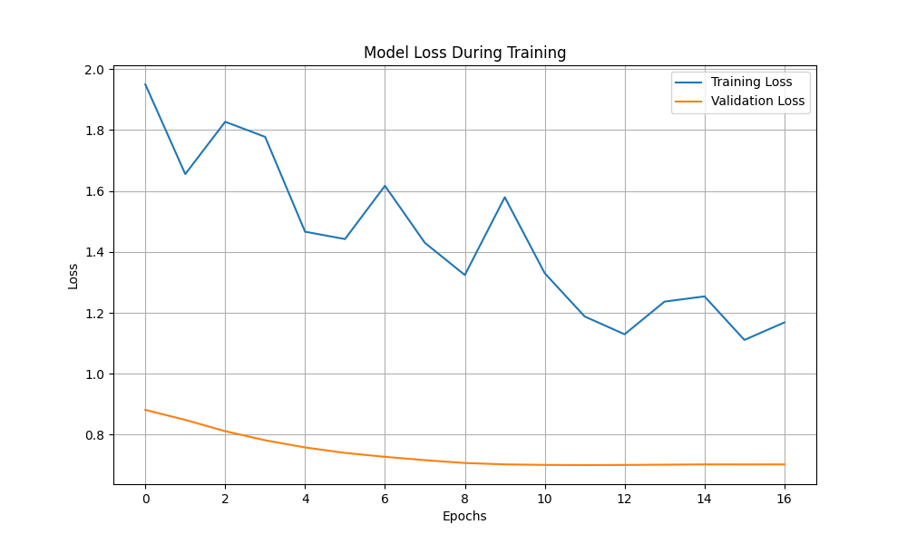

# Table of Contents

1. [Project Overview](#project-overview)
2. [Key Features](#key-features)
3. [Project Files](#project-files)
4. [Libraries Used](#libraries-used)
5. [Project Structure](#project-structure)
   1. [Data Preprocessing](#data-preprocessing)
   2. [TF-IDF Vectorization](#tf-idf-vectorization)
   3. [Model Architecture](#model-architecture)
   4. [Model Training](#model-training)
6. [Usage Instructions](#usage-instructions)
   1. [Set Up Environment](#set-up-environment)
   2. [Download GloVe Embeddings](#download-glove-embeddings)
   3. [Train the Model](#train-the-model)
   4. [Visualize Model Training](#visualize-model-training)
   5. [Evaluate the Model](#evaluate-the-model)
7. [Example Dataset](#example-dataset)
8. [Features Description](#features-description)
9. [Performance Metrics](#performance-metrics)
10. [Future Improvements](#future-improvements)
11. [Conclusion](#conclusion)

# CMOOS MODEL for prediction maintanence

Project Overview

This project aims to predict the Risk Priority Number (RPN) for equipment-related issues using a hybrid model combining both textual descriptions and numeric features. The goal is to improve predictive accuracy for equipment failure, leveraging deep learning and machine learning techniques. The project includes text preprocessing, data augmentation, GloVe embedding integration, and a combination of a GRU-based neural network for text and a fully connected layer for numeric data.
# Key Features

- Text Data Augmentation: Uses synonym replacement to augment the dataset and create robust training samples.

- Numeric and Text Feature Fusion: Combines text descriptions of issues with numeric features (severity, occurrence, detection).

- Pre-trained GloVe Embeddings: Embeds the text data using GloVe vectors to capture semantic meaning.

- Hybrid Model: A deep learning model incorporating Bidirectional GRU for text and fully connected layers for numeric data.

- Learning Rate Scheduler: Dynamically adjusts the learning rate during training to improve model convergence.

# Project Files

- *[cmoos_model.py](cmoos_model.py)*: Contains the code to preprocess data, build the model, and train prediction model.

- *glove.6B.100d.txt*: Pre-trained GloVe embeddings used for text input.

**NB: The file will automatically download when running the model**

- *[issue_predictor_model.keras](issue_predictor_model.keras)*: The saved best model during training.

- [training_validation_loss_advanced.png](training_validation_loss_advanced.png)*: Visualizes the model loss across epochs.

## Libraries Used
- **TensorFlow / Keras**: For building the neural network model.

- **scikit-learn**: For machine learning utilities like data splitting, scaling, and model evaluation.

- **nltk**: For natural language preprocessing, including lemmatization and stopword removal.

- **GloVe Embeddings**: To capture word semantics.

- **gdown**: For downloading the GloVe embeddings.

- **Matplotlib**: For plotting and visualizing the model training process.

- **Logging**: To track and monitor model training.
# Project Structure

1. **Data Preprocessing**:

- Text descriptions are preprocessed to remove stop words, lemmatize tokens, and correct spelling.
- A synonym replacement method is applied to augment text data, enhancing model robustness.

2. **TF-IDF Vectorization**:

- Text data is vectorized using TF-IDF and combined with numeric features for comprehensive input.

3. **Model Architecture**

- A Bidirectional GRU layer processes text inputs, while numeric features pass through dense layers.

- Batch Normalization and Dropout layers prevent overfitting.

- Outputs a predicted RPN value based on combined text and numeric data.

4. Model Training:

- The model is trained on the processed data using Mean Squared Error (MSE) as the loss function and Adam optimizer.

- The learning rate is adjusted dynamically using a learning rate scheduler.

- Best model checkpoints are saved based on validation loss.

# Usage Instructions 

1. Set Up Environment

*install the required Python packages*

pip install -r requirements.txt 

2.  Download GloVe Embeddings

The project uses pre-trained GloVe embeddings. If not present, the embeddings will be automatically downloaded by the script.

3. Train the Model.

*Run the cmoos script to train the 
prediction model*:

python cmoos_model.py

The model will train on the text descriptions and numeric data to predict RPN values, and the results will be saved as checkpoints.

4. Visualize Model Training.
*After training, a plot of the training vs validation loss will be generated*:

5. Evaluate the Model
*Once trained, the model will predict RPN values on unseen test data. The performance metrics (RMSE, MAE) will be logged in the console*.

Example Dataset

| Description            | Severity | Occurrence | Detection | RPN   |
|------------------------|----------|------------|-----------|-------|
| Motor failure           | 8        | 6          | 5         | 0.24  |
| Pump leakage            | 5        | 7          | 4         | 0.14  |
| Equipment overheating   | 7        | 8          | 6         | 0.34  |
| Sensor malfunction      | 4        | 3          | 7         | 0.084 |

**Note: This dataset is augmented using synonym replacement to create diverse variations.**

 *Features Description*

- **Description**: Textual description of the failure or issue.

- **Severity**: Numeric rating of the severity of the failure (1-10).
- **Occurrence**: Numeric rating indicating the frequency of the failure (1-10).

- **Detection**: Numeric rating representing how likely it is to detect the failure before it happens (1-10).

- **RPN (Target)**: Risk Priority Number, calculated as:
  \[
  \text{RPN} = \frac{\text{Severity} \times \text{Occurrence} \times \text{Detection}}{1000}
  \]

# Performance Metrics

*After training, the following metrics are logged*:

- Training RMSE: Measures the root mean squared error on training data.

- Test RMSE: Evaluates model performance on unseen test data.

- Training MAE: Measures mean absolute error during training.

- Test MAE: Quantifies prediction error on test data.

# Future Improvements

- More Robust Augmentation: Explore advanced text augmentation techniques like back-translation.

- Hyperparameter Tuning: Use techniques like grid search to fine-tune model hyperparameters for better results.

- Explainability: Incorporate SHAP to interpret model predictions.
# Conclusion

This project showcases a hybrid approach combining deep learning for text data and machine learning for numeric features to predict the Risk Priority Number. The model's ability to generalize from diverse input sources makes it highly adaptable to various industrial applications.
